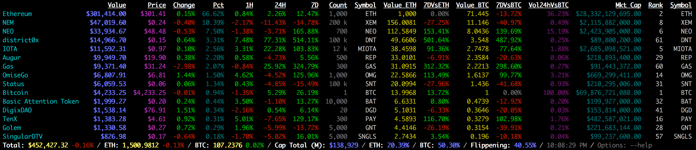
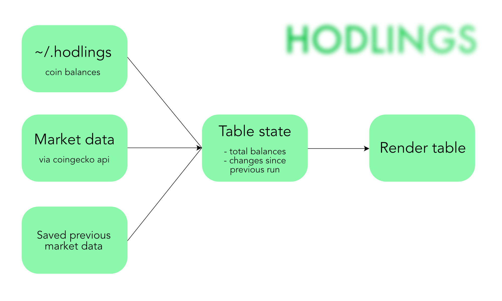

# hodlings

⚠️ You need **node.js** `v13.8.0` or higher.

Display value of crypto-currency hodlings.

Sample output:



Design:



## Prerequisites

**Summary:** `node.js` and `git`. You can skip to the next section if you already have these.

- [node.js](https://nodejs.org/en/download/) platform `v13.8.0`+. Recent version is needed because of ES6 modules.

- [git](https://git-scm.com/downloads) incredible version control (needed in the background to install some dependencies on first install).

**Optional:** if you want easy switching between different `node.js` versions in the future and you are using **unix based systems** (macOS, Linux), you can install `node.js` via fantastic [n](https://github.com/tj/n) (don't download it from *nodejs.org* in this case).

You can also install both `node.js` and `git` via [Homebrew](https://brew.sh) friendly package manager for macOS. [n](https://github.com/tj/n) is still recommended for `node.js` though.

[npm](https://www.npmjs.com) (Node Package Manager) is installed automatically with `node.js` install (just FYI).

## Install hodlings project

In **Terminal** (Linux, macOS) or **Command Prompt** (Windows) type:

``npm install -g hodlings``

## Run

``hodl``

## Options

Try `hodl -h` for complete list and here are a few examples:

``hodl -x eur``

``hodl -x cny``

Add `--eth` to focus on **Ethereum** or `--btc` to focus on **Bitcoin** and save space for two unneeded columns.

## Configure

Create or edit the file `~/.hodlings` (Linux/MacOS: */home/[user]*, Windows: *c:\\Users\\[user]*) containing your portfolio. Use `#` to put in comments.

### Example

Specifying the entire portfolio is simple:

```
# Hodlings
BTC: 0.3123
ETH: 14.99858897
DAI: 148
DEUS: 623
SOL: 500
LUNA: 1000
...
```

Project is currently using [CoinGecko API](https://www.coingecko.com/en/api).

## Notes

If you run `hodl` without this file present, it will create an example file for your convenience.

## Complete options
```
  Usage: hodl [options]

  Options:

    -x, --currency <currency>                 currency to display (usd, eur, cny, jpy...)
    -c, --convert <amount> <token1> <token2>  convert between tokens (and/or fiat)
    --eth                                     focus on eth, hide the bitcoin-specific columns (value-btc, 7-day-change-vs-btc)
    --btc                                     focus on btc, hide the ethereum-specific columns (value-eth, 7-day-change-vs-eth)
    -h, --help                                output usage information
```

## Updates and attribution

**hodlings** is thanking [crytrac](https://github.com/Talljoe/crytrac) project for initial idea.

Thanx again to [Joe Wasson](http://talljoe.com) for a great project which persuaded with simplicity and nice look.
